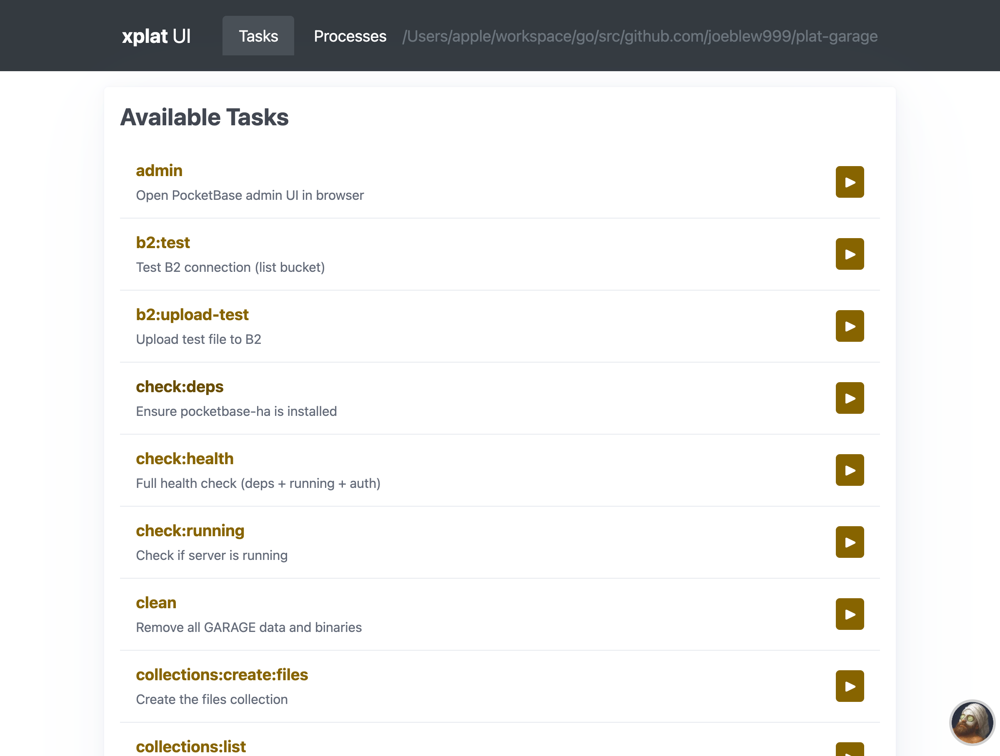
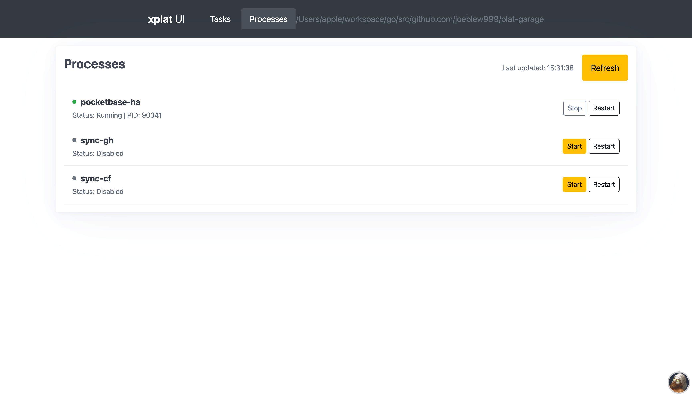

<!-- ============================================================================
GENERATED FILE - DO NOT EDIT MANUALLY
============================================================================
Generated by: xplat internal:docs readme
Source: https://github.com/joeblew999/xplat
============================================================================ -->

# xplat

**One binary to bootstrap and run any plat-* project.**

Instead of installing Task, process-compose, and various CLIs separately,
xplat embeds them all. One binary, works on macOS/Linux/Windows.

## Quick Start

```bash
# Bootstrap a new project
xplat manifest bootstrap

# Build/test (embedded Task)
xplat task build
xplat task test

# Run services (embedded process-compose)
xplat process up

# Install packages from registry
xplat pkg install <name>
```

## Installation

```bash
# One-line install (macOS/Linux)
curl -fsSL https://raw.githubusercontent.com/joeblew999/xplat/main/install.sh | sh

# Or build from source (for xplat developers)
xplat internal dev build
```

## Web UI

Run `xplat up` to launch the unified web dashboard:

| Tasks | Processes |
|-------|-----------|
| [](docs/images/ui-tasks-tab.png) | [](docs/images/ui-processes-tab-running.png) |

**Features:**
- **Tasks** - Run any task from Taskfile.yml with one click
- **Processes** - Monitor, start/stop, view logs for all services
- **Hot Reload** - Enable `dev_mode: true` in xplat.yaml for auto-rebuild on file changes

## Documentation

| Guide | Description |
|-------|-------------|
| [Generation Guide](docs/GENERATION.md) | How files get generated (manifest bootstrap vs gen) |
| [Architecture](ARCHITECTURE.md) | System design and components |
| [Manifest Design](docs/MANIFEST_DESIGN.md) | How xplat.yaml works |
| [Actors](docs/ACTORS.md) | User personas and workflows |

## Commands

### Core

| Command | Description |
|---------|-------------|
| `xplat gen` | Generate project files from YOUR local xplat.yaml |
| `xplat manifest` | Inspect, validate, and bootstrap xplat.yaml manifests |
| `xplat process` | Process orchestration (embedded process-compose) |
| `xplat run` | Run a managed tool |
| `xplat task` | Run Taskfile tasks (embedded Task runner) |
| `xplat update` | Update xplat to the latest version |
| `xplat version` | Print xplat version |

### Package Management

| Command | Description |
|---------|-------------|
| `xplat binary` | Binary management commands |
| `xplat pkg` | Install packages from REMOTE registry (binaries, taskfiles, processes) |

### Process

| Command | Description |
|---------|-------------|
| `xplat release` | Release build orchestration |
| `xplat service` | Manage xplat as a system service |

### Sync

| Command | Description |
|---------|-------------|
| `xplat sync-cf` | Cloudflare sync operations (no wrangler CLI required) |
| `xplat sync-gh` | GitHub sync operations (no gh CLI required) |

### Development

| Command | Description |
|---------|-------------|
| `xplat completion` | Generate the autocompletion script for the specified shell |
| `xplat os` | Cross-platform OS utilities |

### Other

| Command | Description |
|---------|-------------|
| `xplat help` | Help about any command |
| `xplat internal` | xplat developer commands (not for end users) |
| `xplat mcp` | MCP (Model Context Protocol) server |
| `xplat setup` | Environment configuration wizard |
| `xplat ui` | Start Task UI web interface (use 'xplat up' for unified UI) |
| `xplat up` | Start the unified xplat web UI |


---

*This README is auto-generated from xplat commands. Run `xplat internal:docs readme` to regenerate.*
