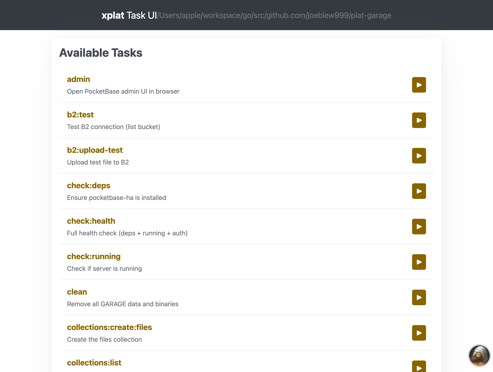
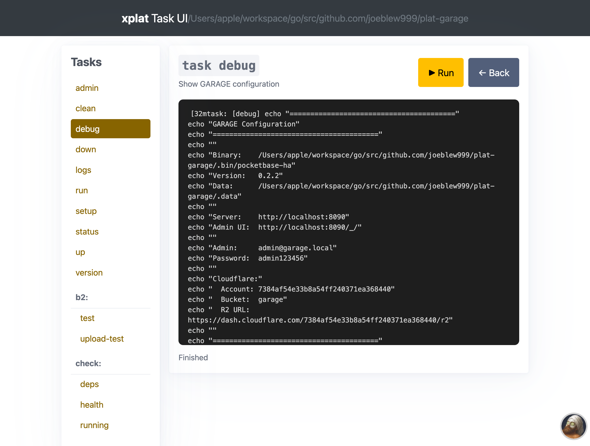

# xplat

Cross-platform Taskfile bootstrapper - a single binary that embeds:
- **Task** (taskfile runner)
- **Process-Compose** (process orchestration)
- **Task UI** (web-based task runner with real-time output)
- **Cross-platform utilities** (rm, cp, mv, glob, etc.)

## Installation

```bash
# Quick install (auto-detects OS/arch)
curl -fsSL https://raw.githubusercontent.com/joeblew999/xplat/main/install.sh | sh

# Or build from source
go build -o xplat .
```

## Task UI

A web-based interface for browsing and running Taskfile tasks with real-time streaming output.

```bash
xplat ui                    # Start on port 3000
xplat ui -p 8080            # Custom port
xplat ui -t Taskfile.ci.yml # Specific taskfile
```

**Features:**
- Browse all tasks with descriptions
- Grouped sidebar organized by namespace (e.g., `check:`, `dev:`, `build:`)
- Real-time SSE streaming output
- Remote taskfile support via `includes:` directive
- Cached remote taskfiles (1-hour disk cache)

### Task List


### Task Execution


## Commands

### Core

| Command | Description |
|---------|-------------|
| `xplat run` | Run a managed tool |
| `xplat task` | Run Taskfile tasks (embedded Task runner) |
| `xplat ui` | Start web-based Task UI |
| `xplat version` | Print xplat version |
| `xplat which` | Find binary in managed locations or PATH |

### File Operations

| Command | Description |
|---------|-------------|
| `xplat cat` | Print file contents |
| `xplat cp` | Copy files or directories |
| `xplat mkdir` | Create directories |
| `xplat mv` | Move or rename files and directories |
| `xplat rm` | Remove files or directories |
| `xplat touch` | Create files or update timestamps |

### Utilities

| Command | Description |
|---------|-------------|
| `xplat env` | Get environment variable |
| `xplat extract` | Extract archives (zip, tar.gz, tar.bz2, tar.xz, 7z, rar) |
| `xplat fetch` | Download files with optional archive extraction |
| `xplat glob` | Expand glob pattern |
| `xplat jq` | Process JSON with jq syntax |

### Package Management

| Command | Description |
|---------|-------------|
| `xplat binary` | Binary management commands |
| `xplat pkg` | Package management from Ubuntu Software registry |

### Taskfile

| Command | Description |
|---------|-------------|
| `xplat archetype` | Taskfile archetype operations |
| `xplat fmt` | Format Taskfiles |
| `xplat lint` | Lint Taskfiles for convention violations |
| `xplat test` | Test a Taskfile based on its archetype |

### Process

| Command | Description |
|---------|-------------|
| `xplat dev` | Development workflow shortcuts |
| `xplat process` | Process orchestration (embedded process-compose) |
| `xplat process-gen` | Generate process-compose.yaml from package registry |

### Other

| Command | Description |
|---------|-------------|
| `xplat completion` | Generate the autocompletion script for the specified shell |
| `xplat docs` | Generate documentation from xplat commands |
| `xplat help` | Help about any command |
| `xplat release` | Release build orchestration |

## Command Reference

### `xplat archetype`

Taskfile archetype operations

**Subcommands:**
- `archetype detect` - Detect archetype for a Taskfile or directory
- `archetype explain` - Explain a specific archetype in detail
- `archetype list` - List all archetypes with their requirements

### `xplat binary`

Binary management commands

**Subcommands:**
- `binary install` - Install a binary (build from source or download)

### `xplat cat`

Print file contents

### `xplat completion`

Generate the autocompletion script for the specified shell

**Subcommands:**
- `completion bash` - Generate the autocompletion script for bash
- `completion fish` - Generate the autocompletion script for fish
- `completion powershell` - Generate the autocompletion script for powershell
- `completion zsh` - Generate the autocompletion script for zsh

### `xplat cp`

Copy files or directories

### `xplat dev`

Development workflow shortcuts

**Subcommands:**
- `dev down` - Stop dev environment
- `dev logs` - Follow dev logs
- `dev status` - Show dev environment status
- `dev up` - Start dev environment (process-compose with TUI)

### `xplat docs`

Generate documentation from xplat commands

**Subcommands:**
- `docs all` - Generate all documentation
- `docs process` - Generate process-compose.generated.yaml from registry
- `docs readme` - Generate README.generated.md from xplat commands
- `docs taskfile` - Generate Taskfile.generated.yml with xplat wrapper tasks

### `xplat env`

Get environment variable

### `xplat extract`

Extract archives (zip, tar.gz, tar.bz2, tar.xz, 7z, rar)

### `xplat fetch`

Download files with optional archive extraction

### `xplat fmt`

Format Taskfiles

### `xplat glob`

Expand glob pattern

### `xplat help`

Help about any command

### `xplat jq`

Process JSON with jq syntax

### `xplat lint`

Lint Taskfiles for convention violations

### `xplat mkdir`

Create directories

### `xplat mv`

Move or rename files and directories

### `xplat pkg`

Package management from Ubuntu Software registry

**Subcommands:**
- `pkg info` - Show package details
- `pkg install` - Install a package (binary + taskfile)
- `pkg list` - List available packages
- `pkg remove` - Remove a package (binary + taskfile include)

### `xplat process`

Process orchestration (embedded process-compose)

### `xplat process-gen`

Generate process-compose.yaml from package registry

**Subcommands:**
- `process-gen add` - Add a package's process to process-compose.yaml
- `process-gen generate` - Generate process-compose.yaml from all registry packages
- `process-gen list` - List packages with process configurations
- `process-gen remove` - Remove a package's process from process-compose.yaml

### `xplat release`

Release build orchestration

**Subcommands:**
- `release binary-name` - Print binary filename for current platform
- `release build` - Build a tool for release
- `release list` - List built release binaries for a tool
- `release matrix` - Output platform build matrix for a tool

### `xplat rm`

Remove files or directories

### `xplat run`

Run a managed tool

### `xplat task`

Run Taskfile tasks (embedded Task runner)

### `xplat ui`

Start web-based Task UI for browsing and running tasks.

**Flags:**
- `-p, --port` - Port to listen on (default: 3000)
- `-t, --taskfile` - Path to Taskfile (default: Taskfile.yml)
- `--no-browser` - Don't open browser automatically

**Features:**
- Parses `includes:` directive to load remote taskfiles
- Groups tasks by namespace prefix in sidebar
- Real-time output streaming via SSE

### `xplat test`

Test a Taskfile based on its archetype

### `xplat touch`

Create files or update timestamps

### `xplat version`

Print xplat version

### `xplat which`

Find binary in managed locations or PATH

**Subcommands:**
- `which doctor` - Diagnose tool installation and version conflicts

